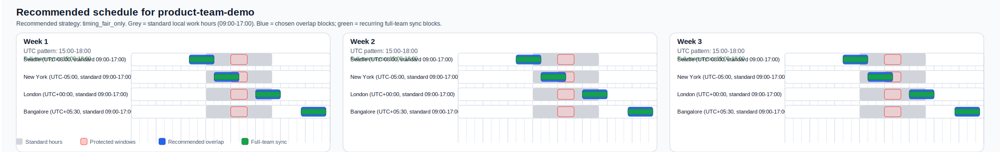
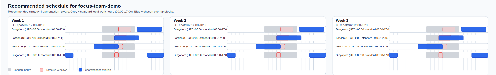
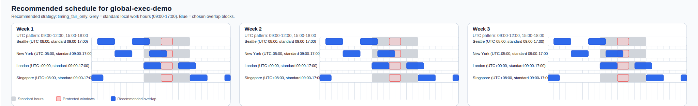

# Equitable Overlap Skill

This folder packages a small exact solver plus the documentation needed to use `equitable-overlap` as a Codex skill.

The skill is for recurring cross-time-zone schedule design, not one-off meeting placement. It compares four strategies:

- `serve_demand_only`
- `timing_fair_only`
- `rotation_heuristic`
- `fragmentation_aware`

It can also enforce the paper's simple full-team-sync extension: require at least `m_k` jointly feasible recurring full-team slots in each week.

## Folder Layout

```text
equitable-overlap/
├── SKILL.md
├── README.md
├── examples/
│   ├── focus-team.json
│   ├── focus-team-visual.svg
│   ├── global-exec.json
│   ├── global-exec-visual.svg
│   ├── product-team.json
│   └── product-team-visual.svg
└── scripts/
    └── solve_equitable_overlap.py
```

## Install As A Codex Skill

Symlink:

```bash
mkdir -p ~/.codex/skills
ln -s /absolute/path/to/equitable-overlap ~/.codex/skills/equitable-overlap
```

Copy:

```bash
mkdir -p ~/.codex/skills
cp -R /absolute/path/to/equitable-overlap ~/.codex/skills/equitable-overlap
```

Then invoke it in Codex with:

```text
$equitable-overlap
```

## Run The Solver Directly

```bash
python3 scripts/solve_equitable_overlap.py examples/product-team.json --pretty
```

Write the visual SVG too:

```bash
python3 scripts/solve_equitable_overlap.py examples/product-team.json --pretty --visual-out examples/product-team-visual.svg
```

Read from stdin:

```bash
cat /path/to/input.json | python3 scripts/solve_equitable_overlap.py --pretty
```

## Input Spec

```json
{
  "team_name": "Optional team name",
  "weeks": 3,
  "days_per_week": 5,
  "target_workday_span_hours": 8,
  "slot_hours_utc": [0, 3, 6, 9, 12, 15, 18, 21],
  "max_slots_per_day": 2,
  "weights": {
    "alpha": 40.0,
    "beta": 1.0,
    "eta": 1.25,
    "delta": 0.8
  },
  "recommendation": {
    "max_served_fraction_drop_vs_timing_fair": 0.02
  },
  "full_team_sync": {
    "required_joint_slots_per_week": 1
  },
  "members": [
    {
      "name": "Alice",
      "timezone": -8,
      "fragmentation_weight": 1.0,
      "protected_windows": [
        {"start_local": 12, "duration_hours": 2}
      ]
    }
  ],
  "collaboration_edges": [
    {
      "members": ["Alice", "Bob"],
      "weekly_demand": 5
    }
  ]
}
```

## Required Fields

- `members`
- for each member:
  - `name`
  - `timezone`

## Optional Fields And Defaults

- `team_name`
  - default: `"equitable-overlap-team"`
- `weeks`
  - default: `3`
  - supported here: `1` to `3`
- `days_per_week`
  - default: `5`
- `target_workday_span_hours`
  - default: `8`
- `slot_hours_utc`
  - default: `[0, 3, 6, 9, 12, 15, 18, 21]`
- `max_slots_per_day`
  - default: `2`
- `weights`
  - defaults:
    - `alpha = 40.0`
    - `beta = 1.0`
    - `eta = 1.25`
    - `delta = 0.8`
- `recommendation.max_served_fraction_drop_vs_timing_fair`
  - default: `0.02`
- `full_team_sync.required_joint_slots_per_week`
  - default: `0`
  - may be a single integer or a list of length `weeks`
  - `1` means "at least one jointly feasible recurring full-team slot each week"
  - `2` means two jointly feasible recurring slots per week, but still on the same repeating daily pattern
- `fragmentation_weight`
  - default: `1.0`
- `protected_windows`
  - default:
    - `{"start_local": 12, "duration_hours": 2}`
- `collaboration_edges`
  - default: fully connected graph with `weekly_demand = 4` for every pair

## Time Zone Notes

- `timezone` is a UTC offset in hours
- whole-hour and half-hour offsets work
- examples:
  - Seattle: `-8`
  - New York: `-5`
  - London: `0`
  - Berlin: `1`
  - Bangalore: `5.5`

## Collaboration Edge Spec

Single weekly demand:

```json
{"members": ["Alice", "Bob"], "weekly_demand": 5}
```

Week-specific demands:

```json
{"members": ["Alice", "Bob"], "weekly_demands": [5, 4, 6]}
```

If `weekly_demands` is used, its length must equal `weeks`.

## Output Spec

The solver returns JSON with:

- `team_name`
- `status`
- `config`
- `constraint_status`
- `recommendation`
- `recommended_visual`
- `strategies`

### Top-Level Field Meanings

- `team_name`
  - normalized team label
- `status`
  - `ok` if the requested problem was solved as stated
  - `infeasible_full_team_sync` if the requested recurring full-team-sync constraint cannot be met on the current UTC grid and protected-hour setup
- `config`
  - normalized configuration actually used
- `constraint_status`
  - whether full-team sync was active, feasible, binding, or infeasible
- `recommendation`
  - final recommended strategy and explanation
- `recommended_visual`
  - structured local-time visual spec for the recommended strategy
- `strategies`
  - results for the active mode:
    - unconstrained results if `constraint_status.mode = "unconstrained"`
    - constrained results if `constraint_status.mode = "full_team_sync"`
    - fallback unconstrained results if `constraint_status.mode = "fallback_unconstrained"`

### `config`

- `weeks`
  - planning horizon `K`
- `days_per_week`
  - workdays used when scaling one daily recurring pattern into weekly totals
- `target_workday_span_hours`
  - local span target before overflow starts
- `slot_hours_utc`
  - candidate UTC grid
- `max_slots_per_day`
  - maximum active UTC slots in one recurring daily pattern
- `weights`
  - objective weights:
    - `alpha`: unmet-demand penalty
    - `beta`: total burden penalty
    - `eta`: team-start penalty
    - `delta`: inequity penalty
- `full_team_sync_required`
  - normalized weekly vector `[m_1, ..., m_K]`

### `constraint_status`

- `mode`
  - `unconstrained`
  - `full_team_sync`
  - `fallback_unconstrained`
- `full_team_sync.active`
  - whether a recurring full-team-sync requirement was requested
- `full_team_sync.required_joint_slots_per_week`
  - normalized weekly requirement vector
- `full_team_sync.feasible`
  - whether the request is feasible on the current grid and constraints
- `full_team_sync.weekly_feasible_pattern_counts`
  - count of daily recurring patterns that satisfy the full-team-sync requirement in each week
- `full_team_sync.binding_for_recommended_strategy`
  - `false` means the sync requirement is non-binding for the recommended strategy
  - `true` means it changes the recommended schedule
  - `null` means sync was inactive or infeasible
- `full_team_sync.binding_by_strategy`
  - same binding test for every strategy
- `full_team_sync.infeasible_reason`
  - present only when the requested sync requirement cannot be met

### `recommendation`

- `selected_strategy`
  - the recommended strategy to adopt
- `reason`
  - plain-English explanation

### `recommended_visual`

- `title`
- `strategy`
- `slot_duration_hours`
- `timezone_reference`
- `standard_work_hours_local`
- `highlighted_overlap_blocks`
- `joint_sync_highlight`
- `weeks`
- `svg_path`
  - only present when `--visual-out` is used

Each `weeks[i]` entry contains:

- `week`
- `utc_pattern`
- `joint_sync_utc_pattern`
- `members`

Each member row contains:

- `name`
- `timezone`
- `label`
- `standard_work_hours_local`
- `active_blocks_local`
- `joint_sync_blocks_local`
- `protected_windows_local`

Each entry in `active_blocks_local`, `joint_sync_blocks_local`, or `protected_windows_local` contains:

- `start`
- `end`
- `start_hour`
- `end_hour`

Visual interpretation:

- grey = standard local work hours
- blue = recommended recurring overlap blocks
- light red = protected windows
- green = recurring full-team-sync blocks when the constraint is active

### `strategies`

Keys:

- `serve_demand_only`
- `timing_fair_only`
- `rotation_heuristic`
- `fragmentation_aware`

Each strategy result contains:

- `strategy`
- `objective`
- `served_fraction`
- `timing_mean`
- `starts_mean`
- `overflow_mean`
- `composite_inequity`
- `team_starts`
- `joint_full_team_slots_per_week`
- `meets_full_team_sync`
- `constraint_binding_vs_unconstrained`
- `weekly_patterns_utc`
- `local_patterns_by_member`

## Mathematical Definitions

Let:

- `N` be the member set
- `K` be the number of weeks
- `d_(e,k)` be demand on collaboration edge `e` in week `k`
- `served_(e,k)` be the overlap actually supplied to that edge
- `total_slack = sum_(e,k) (d_(e,k) - served_(e,k))`
- `T_i` be member `i`'s cumulative timing burden
- `S_i` be member `i`'s cumulative participation starts
- `O_i` be member `i`'s cumulative workday-span overflow
- `lambda_i` be that member's `fragmentation_weight`
- `C_i = T_i + lambda_i * (S_i + O_i)` be composite burden
- `I_timing = sum_i |T_i - mean(T)|`
- `I_comp = sum_i |C_i - mean(C)|`
- `S = team_starts`

Then:

- `served_fraction = total_served / total_demand`
  - where `total_served = sum_(e,k) min(d_(e,k), served_(e,k))`
- `timing_mean = (1 / |N|) * sum_i T_i`
- `starts_mean = (1 / |N|) * sum_i S_i`
- `overflow_mean = (1 / |N|) * sum_i O_i`
- `composite_inequity = I_comp = sum_i |C_i - mean(C)|`
- `team_starts = sum_k days_per_week * count_starts(pattern_k)`

Objective by strategy:

- `serve_demand_only`
  - `objective = alpha * total_slack + 0.25 * team_starts`
- `timing_fair_only`
  - `objective = alpha * total_slack + beta * sum_i T_i + eta * team_starts + delta * I_timing`
- `fragmentation_aware`
  - `objective = alpha * total_slack + beta * sum_i C_i + eta * team_starts + delta * I_comp`
- `rotation_heuristic`
  - greedy weekly heuristic; its returned `objective` is still evaluated on the full fragmentation-aware objective for comparison inside that strategy

Full-team-sync extension:

- `joint_full_team_slots_per_week[k]`
  - number of UTC slots in week `k`'s recurring daily pattern that every member can attend
- `meets_full_team_sync`
  - `joint_full_team_slots_per_week[k] >= m_k` for every week `k`

## What The Strategy Names Mean

- `serve_demand_only`
  - maximize recurring coordination coverage with only a tiny regularizer on team starts
- `timing_fair_only`
  - share awkward-hour burden but ignore fragmentation and workday stretch in the fairness term
- `rotation_heuristic`
  - greedily rotate timing burden across weeks
- `fragmentation_aware`
  - optimize coverage, timing burden, participation starts, workday stretch, and inequity together

## Real Prompt And Answer Examples

These were generated by actually running the bundled solver on the bundled example files.

### Example 1: Product Team With A Weekly Team-Wide Sync

Run:

```bash
python3 scripts/solve_equitable_overlap.py examples/product-team.json --pretty --visual-out examples/product-team-visual.svg
```

Prompt:

```text
$equitable-overlap
Design a recurring weekly overlap schedule for a product team with members in Seattle, New York, London, and Bangalore. We need one recurring full-team sync each week, we want lunch protected locally, and we do not want to overreact if the sync requirement changes nothing.
```

Real answer:

> Recommended strategy: `timing_fair_only`. Use `15:00-18:00 UTC` in all three weeks.  
> This gives one jointly feasible recurring full-team slot per week, and the sync requirement is feasible but non-binding: all four strategies keep the same schedule they chose without the added constraint.  
> Local times are `07:00-10:00` in Seattle, `10:00-13:00` in New York, `15:00-18:00` in London, and `20:30-23:30` in Bangalore.  
> The important part of the output is the constraint diagnosis: `constraint_status.mode = "full_team_sync"`, `binding_for_recommended_strategy = false`, and `weekly_feasible_pattern_counts = [8, 8, 8]`.

Visual:



### Example 2: Focus-Heavy Research Team

Run:

```bash
python3 scripts/solve_equitable_overlap.py examples/focus-team.json --pretty --visual-out examples/focus-team-visual.svg
```

Prompt:

```text
$equitable-overlap
We are a research team in Bangalore, London, New York, and Singapore. We care a lot about uninterrupted work blocks. Recommend recurring overlap windows that reduce fragmented days even if clock-time fairness gets slightly worse.
```

Real answer:

> Recommended strategy: `fragmentation_aware`. Use `12:00-18:00 UTC` in all three weeks.  
> Relative to `timing_fair_only`, this keeps `served_fraction` at `0.9000` versus `0.8667`, cuts `starts_mean` from `20.0` to `15.0`, removes `overflow_mean` from `7.5` to `0.0`, and lowers `composite_inequity` from `103.5` to `93.0`.  
> Local times are `17:30-23:30` in Bangalore, `12:00-18:00` in London, `07:00-13:00` in New York, and `00:00-02:00, 20:00-24:00` in Singapore.

Visual:



### Example 3: Executive Team With Hard Geographic Tension

Run:

```bash
python3 scripts/solve_equitable_overlap.py examples/global-exec.json --pretty --visual-out examples/global-exec-visual.svg
```

Prompt:

```text
$equitable-overlap
Find recurring overlap hours for a leadership team in Seattle, New York, London, and Singapore. We need high coordination coverage and can tolerate some inconvenience, but we do not want one office to always take the entire burden.
```

Real answer:

> Recommended strategy: `timing_fair_only`. Use `09:00-12:00, 15:00-18:00 UTC` in all three weeks.  
> This still looks painful in local time: `01:00-04:00, 07:00-10:00` in Seattle, `04:00-07:00, 10:00-13:00` in New York, `09:00-12:00, 15:00-18:00` in London, and `00:00-02:00, 17:00-20:00, 23:00-24:00` in Singapore.  
> The tradeoff is real rather than hidden: `serve_demand_only` pushes `overflow_mean` to `52.5` and `composite_inequity` to `287.25`, whereas the recommended fair schedule keeps `overflow_mean = 0.0` and `composite_inequity = 25.125`.

Visual:



Sync note:

> If you rerun the same executive example with `full_team_sync.required_joint_slots_per_week = 1`, the solver returns `status = "infeasible_full_team_sync"` and `constraint_status.mode = "fallback_unconstrained"`. In other words, a recurring team-wide slot does not exist on this grid with these protected windows, so the skill reports the best fallback schedule instead of pretending the requirement can be met.

## Recommended Prompt Pattern

```text
$equitable-overlap
Design a recurring weekly overlap schedule for a 5-person team in Seattle, New York, London, and Bangalore. Protect 12-2 local time, target an 8-hour workday span, and require one jointly feasible recurring full-team sync each week if possible.
```

## Practical Guidance

Best results come when users specify:

- who is on the team
- each time zone
- protected local windows
- which pairs actually need recurring collaboration
- whether the team is closer to sales, product, or science coordination
- whether a recurring full-team sync is required
- whether fairness, raw coverage, or minimal fragmentation should dominate if the tradeoffs differ

## Scope Limits

- this is an exact solver for small recurring design problems
- it is best for `1` to `3` weeks
- it works on a fixed UTC candidate grid
- it repeats one daily pattern across all workdays in a week
- it can require `m_k` jointly feasible recurring full-team slots per week
- it does not enforce that multiple syncs occur on distinct weekdays
- it does not solve arbitrary one-off calendar placement
